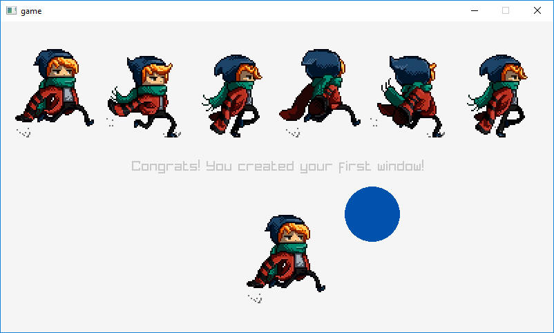
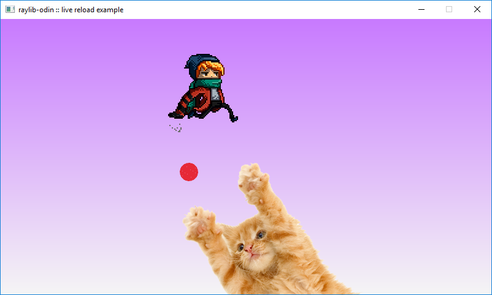
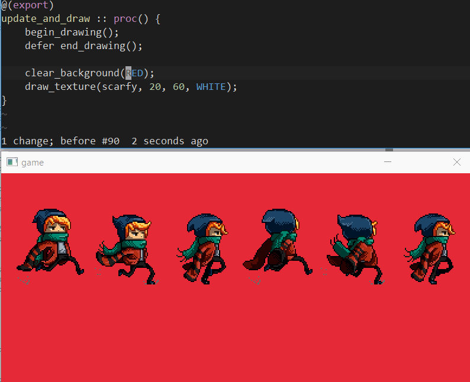
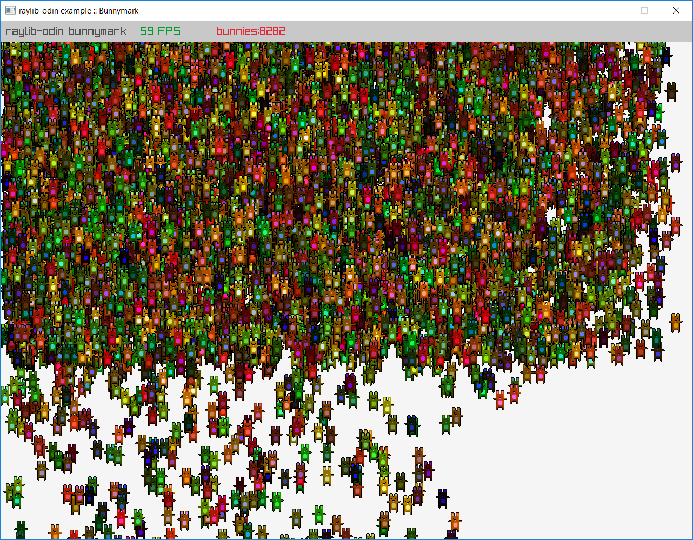
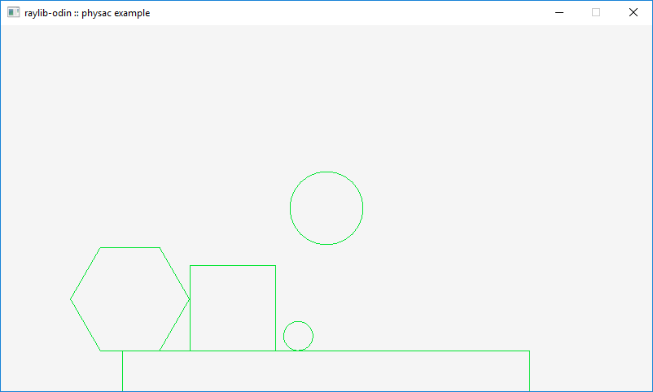

# odin-raylib

## !!

## NEWER AND MAINTAINED REPO HERE: [ftommasi/raylib-odin](https://github.com/ftommasi/raylib-odin)

## !!

Bindings for [raylib](http://www.raylib.com) 3.0.0, a small C gamedev library, for the [odin programming language](https://odin.handmade.network/).

These are usable, but in a pre-alpha state and definitely a work in progress.

from [Kevin Watters](https://kev.town)

## Prerequisites

- Windows 10 (for now)
- Visual Studio 2017
- A command-line prompt opened with the "x64 Native Tools Command Prompt for VS 2017" shortcut
- `odin` on your PATH (built from odin's `master` branch is good)

## Running the examples

### `examples/simple_demo`

To run a simple demo:

```
odin run examples/simple_demo
```

You should see this:



### `examples/live_reload_demo`

To run the live reload demo:

```
scripts\run_live_reload_demo
```

You should see the demo appear. It runs a background thread watching for changes in the source directory. When a change happens, it will rebuild the `bin/game.dll` file--which will then get automatically reloaded by the host process.



Try editing some of the values in `examples/live_reload_demo/game.odin` and saving the file to see the changes instantly.



### `examples/bunnymark`

```
odin run examples/bunnymark
```



### `examples/physac`

```
odin run examples/physac
```



## Modules

Bindings for `raygui` and `raymath` are in an alpha state. See `examples/gui` and `examples/example_raymath`.

## Bindings

To rebuild the bindings to raylib, make sure you have raylib checked out into the directory above raylib-odin, and run `scripts\generate_raylib_bindings.bat`.

## TODO

- fix up bindgen code so that raylib.h doesn't need to be hand-tweaked
- make everything work on OSX and Linux

## Acknowledgements

- Thanks to [@TheElkantor](https://twitter.com/theelkantor) for their article ["How to add hot reload when using raylib"](https://www.developing-stuff.com/how-to-add-hot-reload-when-using-raylib/) - for pointing out that passing function pointers to a plugin was probably the easiest way to get a live reload harness going.

